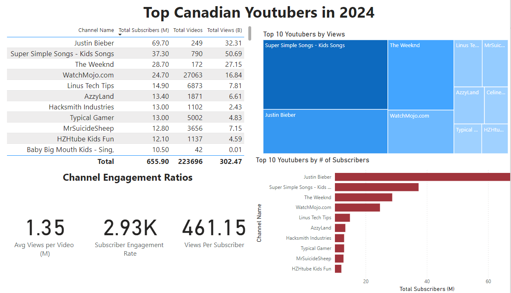

# Data Analysis Portfolio


This is a portfolio showcasing my data analysis of top Canadian Youtubers!


# Table of contents 

- [Objective](#objective)
- [Data Source](#data-source)
- [Stages](#stages)
- [Development](#development)
  - [Pseudocode](#pseudocode)
  - [Data Cleaning](#data-cleaning)
  - [Transform the Data](#transform-the-data)
  - [Create the SQL View](#create-the-sql-view)
- [Testing](#testing)
  - [Data Quality Tests](#data-quality-tests)
- [Visualization](#visualization)
  - [Results](#results)
  - [DAX Measures](#dax-measures)
- [Analysis](#analysis)
  - [Findings](#findings)
  - [Validation](#validation)
  - [Discovery](#discovery)
- [Recommendations](#recommendations)
  - [Potential ROI](#potential-roi)
  - [Potential Courses of Actions](#potential-courses-of-actions)
- [Conclusion](#conclusion)


# Objective 

- What is the key pain point? 

The Head of Marketing aims to identify the top Canadian YouTubers in 2024 to inform strategic marketing campaign collaborations, optimizing engagement and ROI.


- What is the ideal solution? 

To create a dashboard that provides insights into the top Canadian YouTubers in 2024 that includes their 
- subscriber count
- total views
- total videos, and
- engagement metrics

This will help the marketing team make informed decisions about which YouTubers to collaborate with for their marketing campaigns.

## User story 

As the Head of Marketing, I want to use a dashboard that analyses YouTube channel data in Canada. 

This dashboard should allow me to identify the top performing channels based on metrics like subscriber base and average views. 

With this information, I can make more informed decisions about which Youtubers are right to collaborate with, and therefore maximize how effective each marketing campaign is.


# Data source 

- What data is needed to achieve our objective?

We need data on the top Canadian YouTubers in 2024 that includes their 
- channel names
- total subscribers
- total views
- total videos uploaded


- Where is the data coming from? 
The data is sourced from [Kaggle](https://www.kaggle.com/datasets/bhavyadhingra00020/top-100-social-media-influencers-2024-countrywise?resource=download).

# Stages

- Design
- Developement
- Testing
- Analysis 
 


# Design 

## Dashboard components required 
- What should the dashboard contain based on the requirements provided?

To understand what it should contain, we need to figure out what questions we need the dashboard to answer:

1. Who are the top 10 YouTubers with the most subscribers?
2. Which 3 channels have uploaded the most videos?
3. Which 3 channels have the most views?
4. Which 3 channels have the highest average views per video?
5. Which 3 channels have the highest views per subscriber ratio?
6. Which 3 channels have the highest subscriber engagement rate per video uploaded?

For now, these are some of the questions we need to answer, this may change as we progress down our analysis. 


## Tools 


| Tool | Purpose |
| --- | --- |
| Excel | Exploring the data |
| SQL Server | Cleaning, testing, and analyzing the data |
| Power BI | Visualizing the data via interactive dashboards |
| GitHub | Hosting the project documentation and version control |


# Development

## Pseudocode

- What's the general approach in creating this solution from start to finish?

1. Get the data
2. Explore the data in Excel
3. Load the data into SQL Server
4. Clean the data with SQL
5. Test the data with SQL
6. Visualize the data in Power BI
7. Generate the findings based on the insights
8. Write the documentation + commentary
9. Publish the data to GitHub Pages


## Data cleaning 
- What do we expect the clean data to look like? (What should it contain? What contraints should we apply to it?)

The aim is to refine our dataset to ensure it is structured and ready for analysis. 

The cleaned data should meet the following criteria and constraints:

- Only relevant columns should be retained.
- All data types should be appropriate for the contents of each column.
- No column should contain null values, indicating complete data for all records.

Below is a table outlining the constraints on our cleaned dataset:

| Property | Description |
| --- | --- |
| Number of Rows | 100 |
| Number of Columns | 4 |

And here is a tabular representation of the expected schema for the clean data:

| Column Name | Data Type | Nullable |
| --- | --- | --- |
| channel_name | VARCHAR | NO |
| total_subscribers | INTEGER | NO |
| total_views | INTEGER | NO |
| total_videos | INTEGER | NO |


- What steps are needed to clean and shape the data into the desired format?

1. Remove unnecessary columns by only selecting the ones you need
2. Extract Youtube channel names from the first column
3. Rename columns using aliases


### Transform the data 


```sql
/*
# 1. Select the required columns
# 2. Extract the channel name from the 'NOMBRE' column
*/

-- 1.
SELECT
    SUBSTRING(NAME, 1, CHARINDEX('@', NAME) -1) AS channel_name,  -- 2.
    total_subscribers,
    total_views,
    total_videos

FROM
    top_canadian_youtubers_2024
```


### Create the SQL view 

```sql
/*
# 1. Create a view to store the transformed data
# 2. Cast the extracted channel name as VARCHAR(100)
# 3. Select the required columns from the top_can_youtubers_2024 SQL table 
*/

-- 1.
CREATE VIEW view_can_youtubers_2024 AS

-- 2.
SELECT
    CAST(SUBSTRING(name, 1, CHARINDEX('@', name) -1) AS VARCHAR(100)) AS channel_name, -- 2. 
    total_subscribers,
    total_views,
    total_videos

-- 3.
FROM
    top_canadian_youtubers_2024

```


# Testing 

- What data quality and validation checks are you going to create?

Here are the data quality tests conducted:

## Row count check
```sql
/*
# Count the total number of records (or rows) are in the SQL view
*/

SELECT
    COUNT(*) AS no_of_rows
FROM
    view_can_youtubers_2024;

```


## Column count check
### SQL query 
```sql
/*
# Count the total number of columns (or fields) are in the SQL view
*/


SELECT
    COUNT(*) AS column_count
FROM
    INFORMATION_SCHEMA.COLUMNS
WHERE
    TABLE_NAME = 'view_can_youtubers_2024'
```
### Output 


## Data type check
### SQL query 
```sql
/*
# Check the data types of each column from the view by checking the INFORMATION SCHEMA view
*/

-- 1.
SELECT
    COLUMN_NAME,
    DATA_TYPE
FROM
    INFORMATION_SCHEMA.COLUMNS
WHERE
    TABLE_NAME = 'view_can_youtubers_2024';
```

## Duplicate count check
### SQL query 
```sql
/*
# 1. Check for duplicate rows in the view
# 2. Group by the channel name
# 3. Filter for groups with more than one row
*/

-- 1.
SELECT
    channel_name,
    COUNT(*) AS duplicate_count
FROM
    view_can_youtubers_2024

-- 2.
GROUP BY
    channel_name

-- 3.
HAVING
    COUNT(*) > 1;
```
### Output


# Visualization 


## Results

- What does the dashboard look like?



This shows the Top Canadian Youtubers in 2024 so far. 


## DAX Measures

### 1. Total Subscribers (M)
```sql
Total Subscribers (M) = 
VAR million = 1000000
VAR sumOfSubscribers = SUM(view_can_youtubers_2024[total_subscribers])
VAR totalSubscribers = DIVIDE(sumOfSubscribers,million)

RETURN totalSubscribers

```

### 2. Total Views (B)
```sql
Total Views (B) = 
VAR billion = 1000000000
VAR sumOfTotalViews = SUM(view_can_youtubers_2024[total_views])
VAR totalViews = ROUND(sumOfTotalViews / billion, 2)

RETURN totalViews

```

### 3. Total Videos
```sql
Total Videos = 
VAR totalVideos = SUM(view_can_youtubers_2024[total_videos])

RETURN totalVideos

```

### 4. Average Views Per Video (M)
```sql
Average Views per Video (M) = 
VAR sumOfTotalViews = SUM(view_can_youtubers_2024[total_views])
VAR sumOfTotalVideos = SUM(view_can_youtubers_2024[total_videos])
VAR  avgViewsPerVideo = DIVIDE(sumOfTotalViews,sumOfTotalVideos, BLANK())
VAR finalAvgViewsPerVideo = DIVIDE(avgViewsPerVideo, 1000000, BLANK())

RETURN finalAvgViewsPerVideo 

```


### 5. Subscriber Engagement Rate
```sql
Subscriber Engagement Rate = 
VAR sumOfTotalSubscribers = SUM(view_can_youtubers_2024[total_subscribers])
VAR sumOfTotalVideos = SUM(view_can_youtubers_2024[total_videos])
VAR subscriberEngRate = DIVIDE(sumOfTotalSubscribers, sumOfTotalVideos, BLANK())

RETURN subscriberEngRate 

```


### 6. Views per subscriber
```sql
Views Per Subscriber = 
VAR sumOfTotalViews = SUM(view_can_youtubers_2024[total_views])
VAR sumOfTotalSubscribers = SUM(view_can_youtubers_2024[total_subscribers])
VAR viewsPerSubscriber = DIVIDE(sumOfTotalViews, sumOfTotalSubscribers, BLANK())

RETURN viewsPerSubscriber 

```


# Analysis 

## Findings

- What did we find?

For this analysis, we're going to focus on the questions below to get the information we need for our marketing client - 

Here are the key questions we need to answer for our marketing client: 
1. Who are the top 10 YouTubers with the most subscribers?
2. Which 3 channels have uploaded the most videos?
3. Which 3 channels have the most views?
4. Which 3 channels have the highest average views per video?
5. Which 3 channels have the highest views per subscriber ratio?
6. Which 3 channels have the highest subscriber engagement rate per video uploaded?


### 1. Who are the top 10 YouTubers with the most subscribers?

| Rank | Channel Name         | Subscribers (M) |
|------|----------------------|-----------------|
| 1    | Justin Beiber	      | 69.70           |
| 2    | Super Simple Songs   | 37.30           |
| 3    | The Weeknd           | 28.70           |
| 4    | WatchMojo.com        | 24.70           |
| 5    | Linus Tech Tips      | 14.90           |
| 6    | AzzyLand             | 13.40           |
| 7    | Hacksmith Industries | 13.00           |
| 8    | Typical Gamer        | 13.00           |
| 9    | MrSuicideSheep       | 12.80           |
| 10   | HZHtube Kids Fun     | 12.10           |


### 2. Which 3 channels have the most views?

| Rank | Channel Name       | Total Views (B) |
|------|------------------- |-----------------|
| 1    | Super Simple Songs | 50.69           |
| 2    | Justin Bieber      | 32.31           |  
| 3    | The Weeknd         | 27.15           |


### 3. Which 3 channels have uploaded the most videos?

| Rank | Channel Name     | Videos Uploaded |
|------|------------------|-----------------|
| 1    | Global News      | 39,861          |
| 2    | WatchMojo.com    | 27,063          |
| 3    | Step News Agency | 12.314          |


### 4. Which 3 channels have the highest average views per video?

|Rank | Channel Name       | Averge Views per Video (M) |
|-----|--------------------|----------------------------|
| 1    | The Weeknd         | 157.87                    |
| 2    | Justin Beiber      | 129.75            	      |
| 3    | Super Simple Songs | 64.16            	        |


### 5. Which 3 channels have the highest views per subscriber ratio?

| Rank | Channel Name       | Views per Subscriber        |
|------|--------------------|---------------------------- |
| 1    | Super Simple Songs | 1358.90                     |
| 2    | SpyCakes           | 1287.98                     |
| 3    | Super Simple ABCs  | 995.61                      |


### 6. Which 3 channels have the highest subscriber engagement rate per video uploaded?

| Rank | Channel Name    	| Subscriber Engagement Rate  |
|------|------------------------|---------------------------- |
| 1    | Adam's English Lessons | 13,574.66                   |
| 2    | AldosWorld TV          | 3,163.44                    |
| 3    | Ali Gaite              | 12,709.03                   |


### Notes

For this analysis, we'll prioritize analysing the metrics that are important in generating the expected ROI for our marketing client, which are the YouTube channels with the most 

- subscribers
- total views
- videos uploaded

I have omitted Justin Beiber, The Weeknd and SuperSimple Songs from this analysis because while music channels on YouTube boast substantial viewership, this high engagement often does not translate into increased product sales. Music content primarily attracts viewers interested in entertainment rather than purchasing decisions. Therefore, excluding these channels from our analysis will allow us to focus on more relevant content creators whose audiences are more likely to engage with and purchase our products.

## Validation 

### 1. Youtubers with the most subscribers 

#### Calculation breakdown

Campaign idea = product placement 

a. WatchMojo.com 
- Average views per video = 620,000
- Product cost = $8
- Potential units sold per video = 620,000 x 2% conversion rate = 12,400 units sold
- Potential revenue per video = 12,400 x $8 = $99,200
- Campaign cost (one-time fee) = $65,000
- **Net profit = $99,200 - $65,000 = $34,200**

b. Linus Tech Tips

- Average views per video = 1.14 million
- Product cost = $8
- Potential units sold per video = 1.14 million x 2% conversion rate = 22,800 units sold
- Potential revenue per video = 22,800 x $8 = $182,400
- Campaign cost (one-time fee) = $65,000
- **Net Profit = $182,400 - $65,000 = $117,400**

c. AzzyLand

- Average views per video = 3.54 million
- Product cost = $8
- Potential units sold per video = 3.54 million x 2% conversion rate = 70,800 units sold
- Potential revenue per video = 70,800 x $8 = $566,400
- Campaign cost (one-time fee) = $65,000
- **Net Profit  = $566,400 - $65,000 = $501,400**


Best option from category: AzzyLand


#### SQL query 

```sql

-- 1. Declare variablesMos
DECLARE @conversionRate FLOAT = 0.02;        -- The conversion rate @ 2%
DECLARE @productCost FLOAT = 8.0;            -- The product cost @ $5
DECLARE @campaignCost FLOAT = 65000.0;       -- The campaign cost @ 65,000

-- 2. Define a Common Table Expression (CTE)
WITH ChannelData AS (
    SELECT 
        channel_name,
        total_views,
        total_videos,
        ROUND(CAST(total_views AS FLOAT) / total_videos, 0) AS rounded_avg_views_per_video -- rounding to nearest whole number
    FROM 
        [youtube_can_db].[dbo].[view_can_youtubers_2024]
)
--3. 
SELECT 
    channel_name,
    rounded_avg_views_per_video,
    (rounded_avg_views_per_video * @conversionRate) AS potential_units_sold_per_video,
    (rounded_avg_views_per_video * @conversionRate * @productCost) AS potential_revenue_per_video,
    ((rounded_avg_views_per_video * @conversionRate * @productCost) - @campaignCost) AS net_profit
FROM 
    ChannelData

--4.
WHERE
channel_name in ('WatchMojo.com', 'Linus Tech Tips', 'AzzyLand')

-- 5.
ORDER BY
net_profit DESC

```

#### Output


### 2.  Youtubers with the most views

#### Calculation breakdown (based on a campaign of a 6 month contract)

Campaign idea = Influencer marketing 

a. WatchMojo.com

- Average views per video = 620,000
- Product cost = $8
- Potential units sold per video = 620,000 million x 2% conversion rate = 12,400 units sold
- Potential revenue per video = 12,400 x $8 = $99,200
- Campaign cost = $150,000
- **Net profit = $99,200 - $150,000 = -$50,800**

b. Linus Tech Tips

- Average views per video = 1.14 million
- Product cost = $8
- Potential units sold per video = 1.14 million x 2% conversion rate = 22,800 units sold
- Potential revenue per video = 22,800 x $8 = $182,400
- Campaign cost = $150,000
- **Net profit = $182,400 - $130,000 = $32,400**

c. MrSuicideSheep

- Average views per video = 1.96 million
- Product cost = $
- Potential units sold per video = 1.96 million x 2% conversion rate = 39,200 units sold
- Potential revenue per video = 39,200 x $8 = $313,600
- Campaign cost = $150,000
- **Net profit = $313,000 - $130,000 = $163,600**

Best option from category: MrSuicideSheep


#### SQL query 
```sql
-- 1. Declare variables

DECLARE @conversionRate FLOAT = 0.02;        -- The conversion rate @ 2%
DECLARE @productCost MONEY = 8.0;            -- The product cost @ $8
DECLARE @campaignCost MONEY = 150000.0;      -- The campaign cost @ 150,000


-- 2. Define a Common Table Expression (CTE)
WITH ChannelData AS (
    SELECT 
        channel_name,
        total_views,
        total_videos,
        ROUND((CAST(total_views AS FLOAT) / total_videos), -4) AS rounded_avg_views_per_video -- rounding to nearest whole number
    FROM 
        [youtube_can_db].[dbo].[view_can_youtubers_2024]
)
--3. 
SELECT 
    channel_name,
    rounded_avg_views_per_video,
    (rounded_avg_views_per_video * @conversionRate) AS potential_units_sold_per_video,
    (rounded_avg_views_per_video * @conversionRate * @productCost) AS potential_revenue_per_video,
    (rounded_avg_views_per_video * @conversionRate * @productCost) - @campaignCost AS net_profit
FROM 
    ChannelData

--4.
WHERE
channel_name in ('WatchMojo.com', 'Linus Tech Tips', 'MrSuicideSheep')

-- 5.
ORDER BY
net_profit DESC
```

#### Output


### 3. Youtubers with the most videos uploaded

### Calculation breakdown 

Campaign idea = sponsored video series  

1. Global News
- Average views per video = 70,000
- Product cost = $8
- Potential units sold per video = 70,000 x 2% conversion rate = 1,400 units sold
- Potential revenue per video = 1,400 x $8= $11,200
- Campaign cost (10-videos @ $3,000 each) = $30,000
- **Net profit = $11,200 - $30,000 = -$18,800 (potential loss)**

b. WatchMojo.com

- Average views per video = 620,000
- Product cost = $8
- Potential units sold per video = 620,000 x 2% conversion rate = 12,400 units sold
- Potential revenue per video = 12,400 x $8= $99,200
- Campaign cost (10-videos @ $3,000 each) = $30,000
- **Net profit = $99,200 - $30,000 = $69,200 (profit)**

b. Step News Agency

- Average views per video = 160,000
- Product cost = $8
- Potential units sold per video = 160,000 x 2% conversion rate = 3,200 units sold
- Potential revenue per video = 3,200 x $8= $25,600
- Campaign cost (10-videos @ $3,000 each) = $30,000
- **Net profit = $71,000 - $55,000 = -$4,400 (potential loss)**


Best option from category: Yogscast

#### SQL query 
```sql
-- 1. Declare variablesMos
DECLARE @conversionRate FLOAT = 0.02;        -- The conversion rate @ 2%
DECLARE @productCost FLOAT = 8.0;            -- The product cost @ $5
DECLARE @campaignCost FLOAT = 7500.0;       -- The campaign cost per video @ 7500
DECLARE @numberOfVideos INT = 10;            -- The number of videos to sponsor (10)


-- 2. Define a Common Table Expression (CTE)
WITH ChannelData AS (
    SELECT 
        channel_name,
        total_views,
        total_videos,
        ROUND((CAST(total_views AS FLOAT) / total_videos), -4) AS rounded_avg_views_per_video -- rounding to nearest whole number
    FROM 
        [youtube_can_db].[dbo].[view_can_youtubers_2024]
)
--3. 
SELECT 
    channel_name,
    rounded_avg_views_per_video,
    (rounded_avg_views_per_video * @conversionRate) AS potential_units_sold_per_video,
    (rounded_avg_views_per_video * @conversionRate * @productCost) AS potential_revenue_per_video,
    ((rounded_avg_views_per_video * @conversionRate * @productCost) - (@campaignCost * @numberOfVideos)) AS net_profit
FROM 
    ChannelData

--4.
WHERE
channel_name in ('Global News', 'WatchMojo.com', 'Step News Agency')

-- 5.
ORDER BY
net_profit DESC
```

#### Output


## Discovery

- What did we learn?

We discovered that, excluding popular music channels


1. WatchMojo.com, Linus Tech Tips and AzzyLand are the channnels with the most subscribers in Canada
2. Global News, WatchMojo.com and Step News Agency are the channels with the most videos uploaded
3. WatchMojo.com, Linus Tech Tips and MrSuicideSheep are the channels with the most views
4. Entertainment channels seem to be more useful for broader reach, as the channels posting consistently on their platforms and generating the most engagement are focus on entertainment and music 


## Recommendations 

- What do you recommend based on the insights gathered? 
  
1. WatchMojo.com is the best YouTube channel to collaborate with if we want to maximize visbility because this channel has the most YouTube subscribers in Canada. However, AzzyLand has a significantly higher subscriber engagement rate and very similar view count to Linus, but nearly triples Linus and 6x's WatchMojo's rate when looking at views per video, making her the better option overall, as she will yield the highest return on investment
2. Although Global News, WatchMojo.com and Step News Agency are regular publishers on YouTube, it may be worth considering whether collaborating with them with the current budget caps are worth the effort, as the potential return on investments is significantly lower compared to the other channels.
3. MrSuicideSheep is the best YouTuber to collaborate with if we're interested in maximizing reach, but collaborating with AzzyLand and Linus Tech Tips may be better long-term options considering the fact that they both have large subscriber bases and are averaging significantly high number of views.
4. The top 3 channels to form collaborations with are AzzyLand, Linus Tech Tips and WatchMojo.com based on this analysis, because they attract the most engagement on their channels consistently.

To summarize:

1. AzzyLand: Highest ROI with $501,400 net profit per video.
2. WatchMojo.com: Best for maximizing visibility.
3. MrSuicideSheep: Optimal for long-term reach with high engagement.

### Potential ROI 
- What ROI do we expect if we take this course of action?

1. Setting up a collaboration deal with AzzyLand would make the client a net profit of $501,400 per video
2. An influencer marketing contract with MrSuicideSheep can see the client generate a net profit of $163,600
3. If we go with a product placement campaign with Linus Tech Tips, this could  generate the client approximately $117,400 per video. If we advance with an influencer marketing campaign deal instead, this would make the client a one-off net profit of $32,400.


### Action plan
- What course of action should we take and why?

Based on our analysis, we beieve the best channel to advance a long-term partnership deal with to promote the client's products is AzzyLand's channel. 

We'll have conversations with the marketing client to forecast what they also expect from this collaboration. Once we observe we're hitting the expected milestones, we'll advance with potential partnerships with AzzyLand, Linus Tech Tips and MrSuicideSheep channels in the future.   

- What steps do we take to implement the recommended decisions effectively?


1. Contact the teams managing each of these channels, beginning with AzzyLand.
2. Negotiate contracts while staying within the budget limits set for each marketing campaign.
3. Launch the campaigns and monitor their performance relative to the KPIs.
4. Assess the results of the campaigns, gather insights, and make optimizations based on feedback from converted customers and the audiences of each channel.


